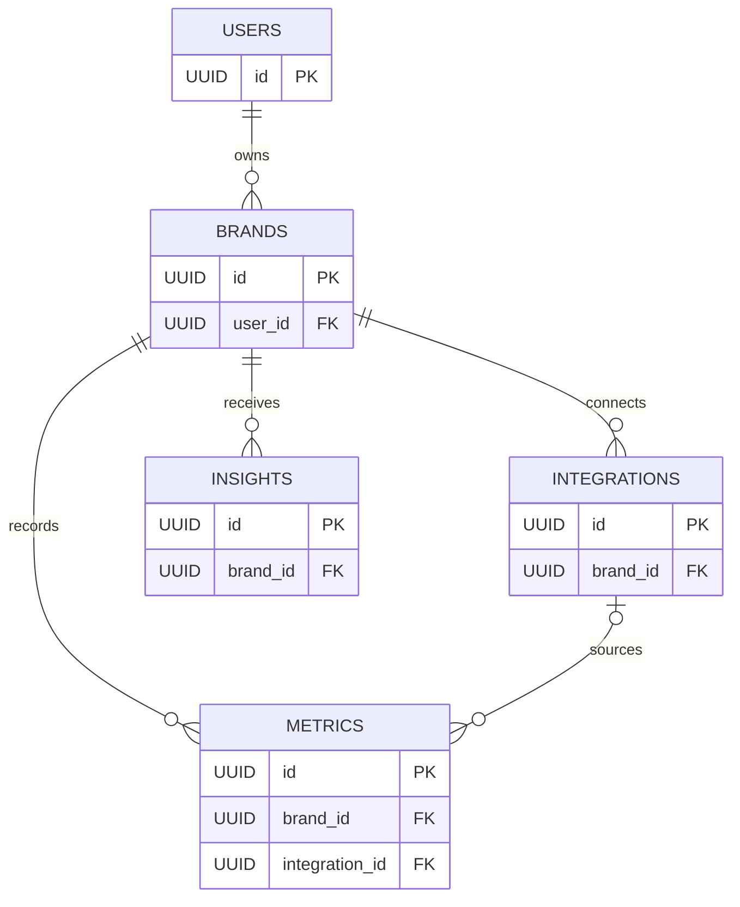

# Project Aura - Database Schema Design

## Overview
PostgreSQL database hosted on Supabase with optimized time-series data storage.

---

## Tables

### 1. users
**Purpose:** Store user authentication and profile information

| Column | Type | Constraints | Description |
|--------|------|-------------|-------------|
| id | UUID | PRIMARY KEY, DEFAULT gen_random_uuid() | Unique user identifier |
| email | VARCHAR(255) | UNIQUE, NOT NULL | User email address |
| password_hash | VARCHAR(255) | NOT NULL | Bcrypt hashed password |
| name | VARCHAR(100) | NULL | User's full name |
| created_at | TIMESTAMPTZ | DEFAULT NOW() | Account creation timestamp |
| updated_at | TIMESTAMPTZ | DEFAULT NOW() | Last update timestamp |
| is_active | BOOLEAN | DEFAULT TRUE | Account active status |

**Indexes:**
- `idx_users_email` on `email`

---

### 2. brands
**Purpose:** Store information about user's connected D2C brands

| Column | Type | Constraints | Description |
|--------|------|-------------|-------------|
| id | UUID | PRIMARY KEY, DEFAULT gen_random_uuid() | Unique brand identifier |
| user_id | UUID | FOREIGN KEY → users(id) ON DELETE CASCADE | Owner of this brand |
| name | VARCHAR(100) | NOT NULL | Brand name |
| domain | VARCHAR(255) | NULL | Brand website domain |
| currency | VARCHAR(3) | DEFAULT 'USD' | Currency code (USD, EUR, etc.) |
| timezone | VARCHAR(50) | DEFAULT 'UTC' | Brand timezone |
| created_at | TIMESTAMPTZ | DEFAULT NOW() | Brand added timestamp |
| updated_at | TIMESTAMPTZ | DEFAULT NOW() | Last update timestamp |

**Indexes:**
- `idx_brands_user_id` on `user_id`

---

### 3. integrations
**Purpose:** Store OAuth credentials and connection status for third-party platforms

| Column | Type | Constraints | Description |
|--------|------|-------------|-------------|
| id | UUID | PRIMARY KEY, DEFAULT gen_random_uuid() | Unique integration identifier |
| brand_id | UUID | FOREIGN KEY → brands(id) ON DELETE CASCADE | Associated brand |
| platform | VARCHAR(50) | NOT NULL | 'shopify', 'meta', 'google_ads' |
| status | VARCHAR(20) | DEFAULT 'disconnected' | 'connected', 'disconnected', 'error' |
| access_token | TEXT | NULL | Encrypted OAuth access token |
| refresh_token | TEXT | NULL | Encrypted OAuth refresh token |
| token_expires_at | TIMESTAMPTZ | NULL | Token expiration timestamp |
| platform_account_id | VARCHAR(255) | NULL | External account ID |
| platform_account_name | VARCHAR(255) | NULL | External account name |
| last_sync_at | TIMESTAMPTZ | NULL | Last successful data sync |
| metadata | JSONB | DEFAULT '{}' | Additional platform-specific data |
| created_at | TIMESTAMPTZ | DEFAULT NOW() | Integration created |
| updated_at | TIMESTAMPTZ | DEFAULT NOW() | Last update |

**Indexes:**
- `idx_integrations_brand_id` on `brand_id`
- `idx_integrations_platform` on `platform`
- `idx_integrations_status` on `status`

**Unique Constraint:**
- `unique_brand_platform` on `(brand_id, platform)`

---

### 4. metrics
**Purpose:** Store time-series performance metrics from all platforms

| Column | Type | Constraints | Description |
|--------|------|-------------|-------------|
| id | UUID | PRIMARY KEY, DEFAULT gen_random_uuid() | Unique metric identifier |
| brand_id | UUID | FOREIGN KEY → brands(id) ON DELETE CASCADE | Associated brand |
| integration_id | UUID | FOREIGN KEY → integrations(id) ON DELETE SET NULL | Source integration |
| date | DATE | NOT NULL | Metric date (for daily aggregation) |
| metric_type | VARCHAR(50) | NOT NULL | Type of metric |
| value | NUMERIC(15,2) | NOT NULL | Metric value |
| currency | VARCHAR(3) | DEFAULT 'USD' | Currency for monetary values |
| metadata | JSONB | DEFAULT '{}' | Additional context |
| created_at | TIMESTAMPTZ | DEFAULT NOW() | Record created |
| updated_at | TIMESTAMPTZ | DEFAULT NOW(), NOT NULL | Last update; maintained by the metrics update trigger |

**Metric Types:**
- `revenue` - Total revenue
- `orders` - Number of orders
- `ad_spend` - Total ad spend
- `impressions` - Ad impressions
- `clicks` - Ad clicks
- `conversions` - Conversion events
- `new_customers` - New customer count

**Indexes:**
- `idx_metrics_brand_date` on `(brand_id, date DESC)`
- `idx_metrics_type_date` on `(metric_type, date DESC)`
- `idx_metrics_created` on `created_at DESC`
- `idx_metrics_brand_type_date` on `(brand_id, metric_type, date DESC)`

**Unique Constraint:**
- A unique constraint on `(brand_id, metric_type, date)`. Fresh databases created with migration `002` use `unique_brand_metric_type_date`; the verified existing Aura database uses `unique_brand_metric_date`.

---

### 5. insights
**Purpose:** Store auto-generated insights and alerts

| Column | Type | Constraints | Description |
|--------|------|-------------|-------------|
| id | UUID | PRIMARY KEY, DEFAULT gen_random_uuid() | Unique insight identifier |
| brand_id | UUID | FOREIGN KEY → brands(id) ON DELETE CASCADE | Associated brand |
| insight_type | VARCHAR(50) | NOT NULL | Type of insight |
| priority | VARCHAR(20) | DEFAULT 'medium' | 'high', 'medium', 'low' |
| title | VARCHAR(255) | NOT NULL | Short insight title |
| description | TEXT | NOT NULL | Detailed insight description |
| action_items | JSONB | DEFAULT '[]' | Recommended actions |
| related_data | JSONB | DEFAULT '{}' | Supporting data/metrics |
| is_read | BOOLEAN | DEFAULT FALSE | User has viewed |
| created_at | TIMESTAMPTZ | DEFAULT NOW() | Insight generated |
| expires_at | TIMESTAMPTZ | NULL | Insight expiration |

**Insight Types:**
- Current rules engine: `revenue_drop`, `high_performer`, `order_drop`, `aov_opportunity`, `acquisition_drop`, and `weekly_summary`
- Legacy accepted values: `high_cpa`, `low_roas`, `budget_recommendation`, and `conversion_drop`

**Indexes:**
- `idx_insights_brand_created` on `(brand_id, created_at DESC)`
- `idx_insights_priority` on `priority`
- `idx_insights_is_read` on `is_read`

---

### 6. shopify_oauth_states
**Purpose:** Store one-time, short-lived Shopify OAuth state records for the backend.

| Column | Type | Constraints | Description |
|--------|------|-------------|-------------|
| state_hash | CHAR(64) | PRIMARY KEY | SHA-256 hash of the browser-visible state value |
| user_id | UUID | FOREIGN KEY → users(id) ON DELETE CASCADE | User who started the connection |
| brand_id | UUID | FOREIGN KEY → brands(id) ON DELETE CASCADE | Brand being connected |
| shop_domain | VARCHAR(255) | NOT NULL | Shopify shop expected on callback |
| expires_at | TIMESTAMPTZ | NOT NULL | Ten-minute state expiration |
| created_at | TIMESTAMPTZ | DEFAULT NOW() | Record creation time |

The callback deletes a matching, unexpired row before it exchanges the Shopify code. This makes a state value single-use without storing the raw state in the database.

---

## Relationships

### Entity relationship diagram



`PK` means primary key: the table's unique identity. `FK` means foreign key: a column that points to another table. `||--o{` means one parent can have zero or many children. `o|--o{` means a metric can optionally have one integration, while an integration can have many metrics.

### Compact relationship view

```
users (1) ──< brands (many)
brands (1) ──< integrations (many)
brands (1) ──< metrics (many)
brands (1) ──< insights (many)
integrations (1) ──< metrics (many)
```

### What happens when data is deleted?

The database uses foreign-key rules to prevent data from being left behind
without its parent record.

| If this is deleted | What happens next |
|---|---|
| A user | Their brands are deleted. Those brands' integrations, metrics, and insights are deleted too. |
| A brand | Its integrations, metrics, and insights are deleted too. |
| An integration | Its metrics stay, but their `integration_id` becomes empty (`NULL`). |
| A metric | Only that metric is deleted. |
| An insight | Only that insight is deleted. |

`CASCADE` means that deleting a parent automatically deletes its related child
records. `SET NULL` means the child record stays, but its optional connection
to the deleted record is removed.

### Shopify disconnect is not deletion

When a user disconnects Shopify, Aura does not delete the Shopify integration
or its historical metrics. It changes the integration status to
`disconnected`.

Aura does not currently have an API endpoint for deleting a user or brand.
Before adding one, we must require authentication, confirm brand ownership,
warn the user that the deletion is permanent, and decide whether a recovery
period is needed.

---

## Security

1. **Encryption at rest:** Provided by Supabase infrastructure.
2. **OAuth token encryption:** Not implemented by the tracked backend; access tokens are currently stored in the `integrations` table and require a separate security improvement.
3. **Row Level Security (RLS):** RLS is enabled in the active Supabase database, with dashboard-created `auth.uid()` policies. Aura currently uses custom backend JWT authentication rather than Supabase Auth, so these policies are not Aura's active authorization mechanism. Read `docs/11_SUPABASE_RLS_REVIEW.md` before changing database access.
4. **Password Hashing:** Bcrypt is handled in the backend.

---

**Schema Version:** Migration series `001` + `002`
**Last Updated:** 2026-07-26
